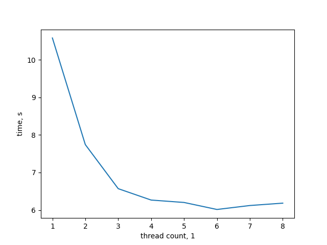

# Inverted Index

Python implementation of inverted index struncture using process-based parallelism methods.

  * [Requirements](#requirements)
  * [Run Locally](#run-locally)
  * [Running Tests](#running-tests)
  * [Performance](#performance)


## Requirements
* [Python](https://www.python.org/) 3.8 or higher
* [pip](https://pip.pypa.io/en/stable/) 19.3.1 or higher
## Run Locally

Clone the project

```bash
  git clone https://github.com/modeAC/inverted_index.git
```

Go to the project directory

```bash
  cd inverted_index
```

Install dependencies

```bash
  pip install -r requirements.txt
```

Start the server

```bash
  python index_server.py
```
Start interface
```bash
  python index_interface.py
```


## Running Tests

To run tests, run the following command

```bash
  python index_test.py
```


## Performance

| th_no | 1     | 2    | 3    | 4    | 5    | 6    | 7    | 8    |
|-------|-------|------|------|------|------|------|------|------|
| time  | 10.58 | 7.74 | 6.57 | 6.27 | 6.20 | 6.02 | 6.12 | 6.18 |
